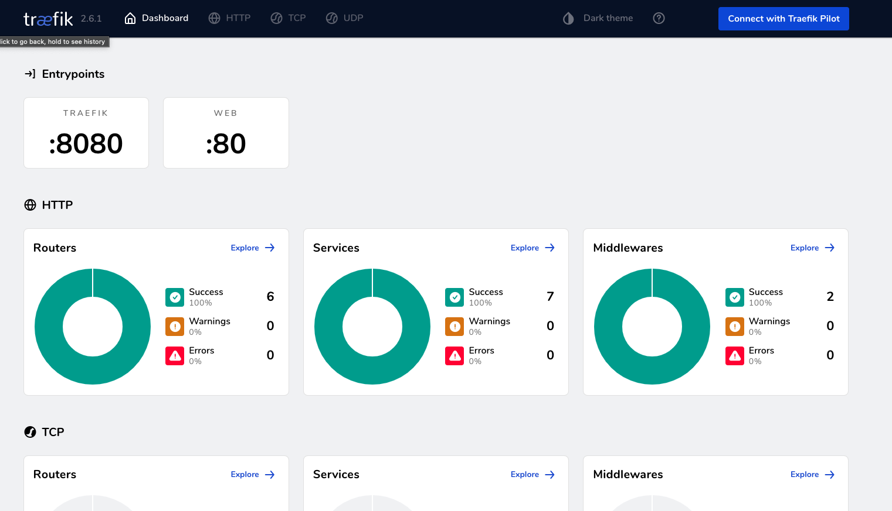
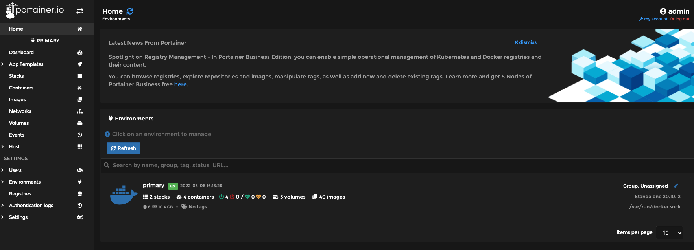
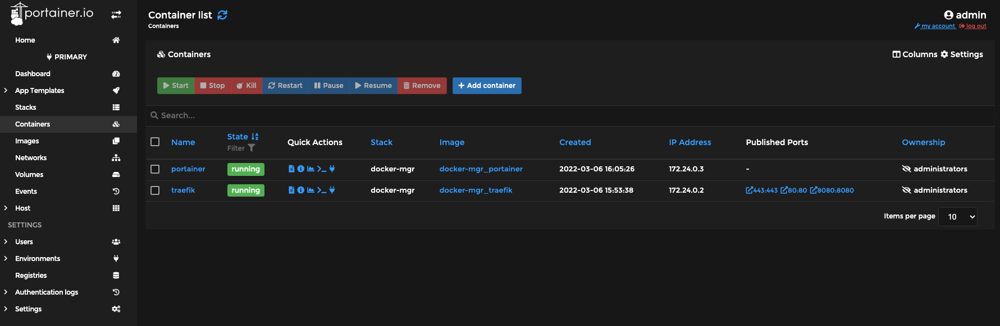

# docker-manager

Local Docker development infrastructure with Traefik, Portainer, CoreDNS and Keycloak.

ローカルのDocker開発環境で共通利用するインフラを管理します。
ローカル開発専用とし、Traefik / Portainer / Keycloak の管理UIを外部公開用途では使用しません。

## Setup

```bash
cp .env.sample .env
```

`.env` の `KEYCLOAK_ADMIN` / `KEYCLOAK_ADMIN_PASSWORD` を設定して起動します。

```bash
docker compose up -d
```

- Traefik: `http://traefik.localhost`
- Portainer: `http://portainer.localhost`
- Keycloak: `http://keycloak.localhost`

## Screenshots

### Traefik



### Portainer



Containers から起動中のコンテナを確認できます。



## Local DNS

利用プロジェクト固有の名前解決が必要な場合は、local overrideを作成します。

```bash
cp local/coredns/projects.conf.example local/coredns/projects.conf
```

```corefile
rewrite name example.localhost host.docker.internal
```

`local/coredns/*.conf` はGit管理されません。共通設定は `config/coredns/Corefile` を正本とします。

## Image versions

`docker-compose.yml` では image を patch version まで固定します。Portainer は LTS stream を使用します。
major / minor version を更新する場合は、各製品の release notes / migration guide を確認してから更新します。

## Layout

```text
.
├── config
│   ├── coredns
│   │   └── Corefile
│   └── traefik
│       └── traefik.yml
├── data
│   ├── keycloak
│   └── portainer
├── local
│   └── coredns
│       └── projects.conf.example
├── docker-compose.yml
└── README.md
```

- `config/`: Git管理する共通設定
- `data/`: Git管理しない永続データ
- `local/`: Git管理しない利用者・プロジェクト固有設定
