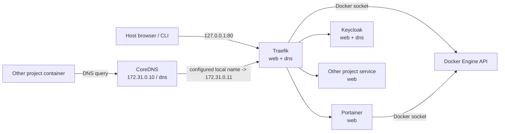

# Architecture

`docker-manager` は、ローカルのDocker開発環境で複数projectから共有するinfrastructure stackです。
設定の正本は `docker-compose.yml` と `config/` 配下に置き、永続データと利用者固有設定を分離します。

## 全体構成



Hostへ公開するHTTP portはTraefikの `127.0.0.1:80` / `[::1]:80` だけです。PortainerとKeycloakはhost portを直接publishせず、Traefik経由でアクセスします。CoreDNSの53番portもhostへpublishしません。

## Service

| Service | Role | Network | Persistent data |
| --- | --- | --- | --- |
| Traefik | reverse proxy / Docker service discovery | `web`, `dns` | なし |
| Portainer | Docker管理UI | `web` | `data/portainer` |
| CoreDNS | container向けlocal name resolution | `dns` | なし |
| Keycloak | local authentication / identity provider | `web`, `dns` | `data/keycloak` |

image version、port、label、health checkなどの実値は `docker-compose.yml` を正本とします。

## `web` network

`web` はTraefikがbackend serviceへ接続するためのshared bridge networkです。既定名は `docker-manager_web` で、`.env` の `TRAEFIK_NETWORK` でnetwork名だけ変更できます。

他projectからTraefikを利用するserviceは、このnetworkを `external: true` で参照します。Docker Composeではexternal networkのlifecycleを参照側projectが管理せず、既存networkがない場合は起動に失敗します。

TraefikのDocker providerは `exposedByDefault: false` なので、routeを作成するserviceには `traefik.enable=true` が必要です。

serviceが複数networkへ接続する場合は、Traefikがbackend接続に使うnetworkを `traefik.docker.network` で明示します。Traefik公式でも、複数network接続時にnetworkを明示しない場合は選択が不定になるため指定を推奨しています。

## `dns` network

`dns` はCoreDNSをcontainerから利用するためのshared bridge networkです。

現在の設定は次のとおりです。

| Item | Value |
| --- | --- |
| network name | `${DNS_NETWORK:-docker-manager_dns}` |
| subnet | `172.31.0.0/24` |
| CoreDNS | `172.31.0.10` |
| Traefik | `172.31.0.11` |

CoreDNSは `config/coredns/Corefile` を共通設定として読み、`local/coredns/*.conf` の利用者固有rewriteをimportします。`local/coredns/*.conf` はGit管理しません。

local nameをTraefikへ向ける場合は、例えば次のrewriteを追加します。

```corefile
rewrite name example.localhost host.docker.internal
```

CoreDNS containerでは `host.docker.internal` を `172.31.0.11` に固定しているため、この名前は`dns` network上のTraefikへ解決されます。rewriteに一致しないqueryはDocker内蔵DNS `127.0.0.11` へforwardします。

## Configuration / data / local の境界

```text
config/   Git管理する共通設定
  coredns/Corefile
  traefik/traefik.yml

data/     Git管理しない永続runtime data
  keycloak/
  portainer/

local/    Git管理しない利用者・project固有設定
  coredns/*.conf
```

`docker-compose.yml` はservice構成とversionの正本です。`data/` の内容を別環境へ再現可能な設定として扱わず、必要に応じてbackupします。

## Network変更時の注意

`TRAEFIK_NETWORK` / `DNS_NETWORK` で変更できるのはnetwork名だけです。

`172.31.0.0/24` が他のDocker networkと衝突する場合、現状はsubnetを1つの環境変数では変更できません。変更する場合は、少なくとも次を整合させます。

- `docker-compose.yml` の `dns.ipam.config[].subnet`
- CoreDNSの `ipv4_address`
- Traefikの `dns` network側 `ipv4_address`
- CoreDNSの `extra_hosts` にあるTraefik IP
- `docs/integration.md` のDNS server例
- `.github/workflows/ci.yml` のCoreDNS検証値

一部だけ変更するとname resolutionまたはCIが壊れるため、同一変更として扱います。

## 参考資料

- Docker Compose: Networks
  - https://docs.docker.com/reference/compose-file/networks/
- Docker Compose: Networking
  - https://docs.docker.com/compose/how-tos/networking/
- Docker Compose: Services (`dns`, `networks`)
  - https://docs.docker.com/reference/compose-file/services/
- Traefik: Docker provider
  - https://doc.traefik.io/traefik/reference/install-configuration/providers/docker/
- Traefik: Docker routing labels
  - https://doc.traefik.io/traefik/reference/routing-configuration/other-providers/docker/
