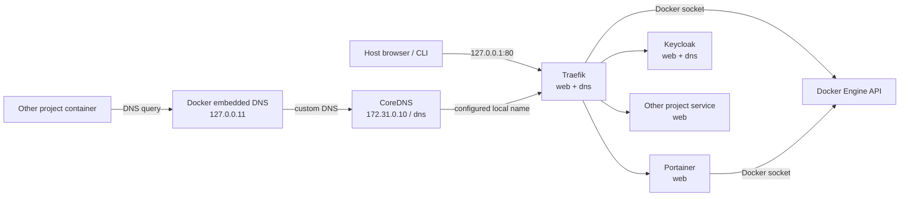
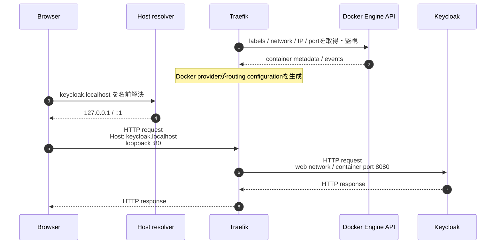
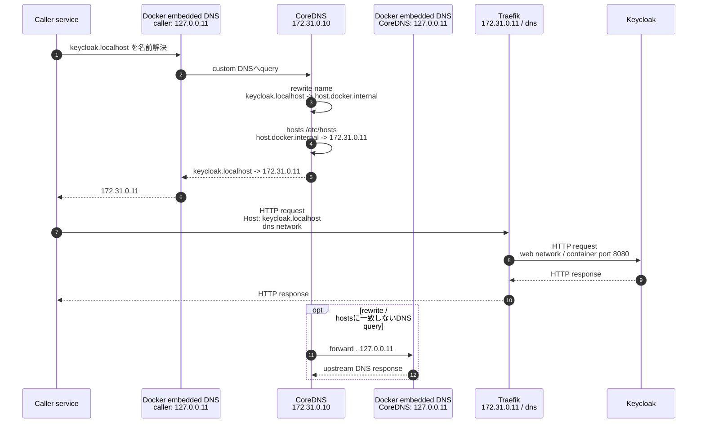
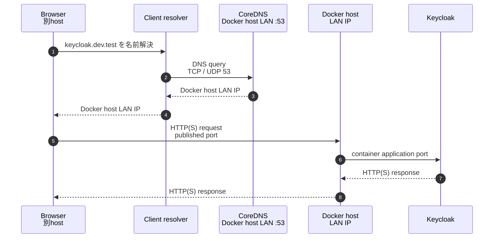

# Architecture

`docker-manager` は、ローカルのDocker開発環境で複数projectから共有するinfrastructure stackです。
service構成の正本は `docker-compose.yml`、共通設定の正本は `config/` 配下です。

## 全体構成



HostへpublishするHTTP portはTraefikの `127.0.0.1:80` / `[::1]:80` だけです。Portainer、Keycloak、CoreDNSはhostへ直接publishしません。

## 接続シーケンス

### Host browserからserviceへ（現行構成）

`http://keycloak.localhost` へのアクセス例です。



`.localhost` はloopback向けのspecial-use nameです。CoreDNSはhostへ53番portをpublishしていないため、この経路の名前解決には関与しません。

TraefikはDocker APIから得たcontainer metadataをもとにDocker provider内でrouting configurationを生成し、`Host` ruleに一致したrequestを `web` network経由でKeycloakへ転送します。

### Containerからlocal URLでserviceへ（現行構成）

`dns: 172.31.0.10` を設定したcontainerから `http://keycloak.localhost` へアクセスする例です。



user-defined network上のcontainerはDocker embedded DNS `127.0.0.11` を使います。Composeの `dns` で指定したCoreDNSは、そのupstream DNSとして利用されます。

CoreDNSのexact `rewrite name` はresponse nameも元へ書き戻します。図中の2つの `127.0.0.11` は、それぞれcaller containerとCoreDNS containerから見える別のembedded DNSです。

> `.localhost` はapplicationやresolver自身がloopbackとして処理し、DNS queryを送らない場合があります。この図はcallerがcontainerのDNS resolverを利用する場合の経路です。

### 同一Docker network内でservice名を使う場合（現行構成）

`http://service-name:port` のようにservice名を直接使う通信では、Docker embedded DNSが名前解決し、callerから対象containerへ直接接続します。CoreDNSとTraefikは経由しません。

### 別hostからCoreDNSを利用する場合（将来構成）

以下は**未実装の構成例**です。別hostのbrowserからCoreDNSを利用し、TraefikのDocker labelsに依存せずKeycloakへ直接接続します。



この構成では `.localhost` を使いません。`.localhost` はclient自身のloopback向けなので、例ではtesting用途に予約された `.test` を使います。

実装にはCoreDNSの53/TCP・53/UDPとKeycloakのapplication portのpublish、または別途direct routingが必要です。host外へ公開するため、firewall、TLS、Keycloak `hostname` などのsecurity設計も見直します。

Traefikを残してDocker labelsだけを使わない場合は、CoreDNSでTraefikの到達可能IPを返し、Traefikのfile providerでrouter / serviceを明示定義する方式があります。

## Service

| Service | Role | Network | Persistent data |
| --- | --- | --- | --- |
| Traefik | reverse proxy / Docker service discovery | `web`, `dns` | なし |
| Portainer | Docker管理UI | `web` | `data/portainer` |
| CoreDNS | container向けlocal name resolution | `dns` | なし |
| Keycloak | local authentication / identity provider | `web`, `dns` | `data/keycloak` |

image version、port、label、health checkなどの実値は `docker-compose.yml` を正本とします。

## `web` network

`web` はTraefikがbackend serviceへ接続するshared bridge networkです。既定名は `docker-manager_web` で、`.env` の `TRAEFIK_NETWORK` でnetwork名を変更できます。

他projectから利用するserviceは、このnetworkを `external: true` で参照します。routeを作成するserviceには `traefik.enable=true` が必要です。

serviceが複数networkへ接続する場合は、backend接続に使うnetworkを `traefik.docker.network` で明示します。

## `dns` network

`dns` はCoreDNSをcontainerから利用するshared bridge networkです。

| Item | Value |
| --- | --- |
| network name | `${DNS_NETWORK:-docker-manager_dns}` |
| subnet | `172.31.0.0/24` |
| CoreDNS | `172.31.0.10` |
| Traefik | `172.31.0.11` |

共通設定は `config/coredns/Corefile`、利用者固有のrewriteはGit管理しない `local/coredns/*.conf` に置きます。

```corefile
rewrite name example.localhost host.docker.internal
```

CoreDNS containerでは `host.docker.internal` を `172.31.0.11` に固定しています。rewrite / hostsに一致しないqueryはDocker embedded DNS `127.0.0.11` へforwardします。

## Configuration / data / local の境界

```text
config/   Git管理する共通設定
  coredns/Corefile
  traefik/traefik.yml

data/     Git管理しない永続runtime data
  keycloak/
  portainer/

local/    Git管理しない利用者・project固有設定
  coredns/*.conf
```

`data/` は再現可能な設定の正本として扱わず、必要に応じてbackupします。

## Network変更時の注意

`TRAEFIK_NETWORK` / `DNS_NETWORK` で変更できるのはnetwork名だけです。

`172.31.0.0/24` を変更する場合は、次を同じ変更単位で更新します。

- `docker-compose.yml` の `dns.ipam.config[].subnet`
- CoreDNSの `ipv4_address`
- Traefikの `dns` network側 `ipv4_address`
- CoreDNSの `extra_hosts` にあるTraefik IP
- `docs/integration.md` のDNS server例
- `.github/workflows/ci.yml` のCoreDNS検証値

## 参考資料

- RFC 2606: Reserved Top Level DNS Names (`.test`)
  - https://www.rfc-editor.org/rfc/rfc2606
- RFC 6761: Special-Use Domain Names (`localhost.`)
  - https://www.rfc-editor.org/rfc/rfc6761
- Docker Engine: Networking overview / DNS services
  - https://docs.docker.com/engine/network/
- Docker Engine: Port publishing and mapping
  - https://docs.docker.com/engine/network/port-publishing/
- Docker Compose: Networks
  - https://docs.docker.com/reference/compose-file/networks/
- Docker Compose: Services (`dns`, `networks`, `ports`)
  - https://docs.docker.com/reference/compose-file/services/
- CoreDNS: rewrite
  - https://coredns.io/plugins/rewrite/
- CoreDNS: hosts
  - https://coredns.io/plugins/hosts/
- CoreDNS: forward
  - https://coredns.io/plugins/forward/
- Traefik: Docker provider
  - https://doc.traefik.io/traefik/reference/install-configuration/providers/docker/
- Traefik: File provider
  - https://doc.traefik.io/traefik/reference/dynamic-configuration/file/
- Keycloak: Configuring the hostname
  - https://www.keycloak.org/server/hostname
